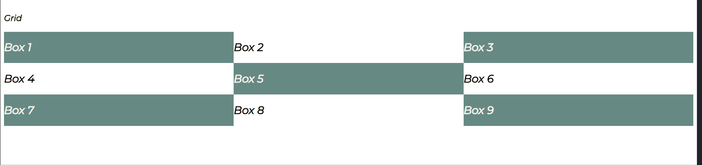
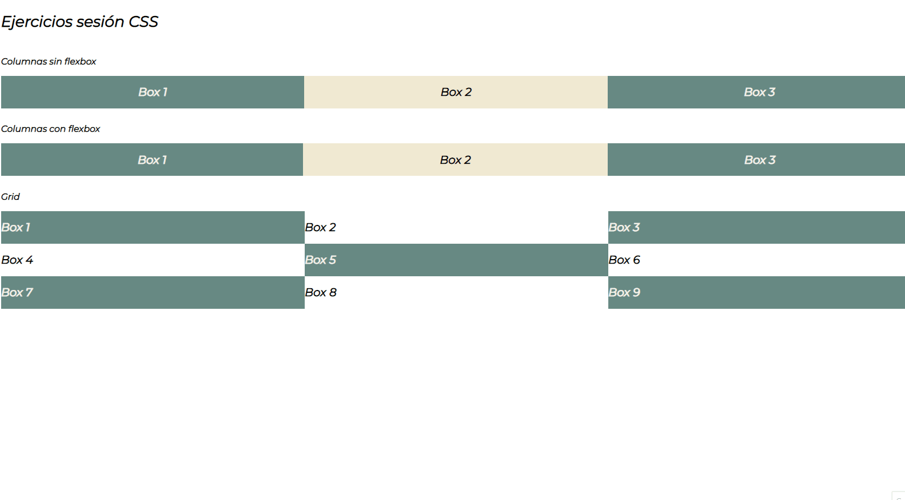

# 🚀 Ejercicios introducción CSS

1. Crear un archivo HTML y CSS para conseguir el siguiente resultado sin utilizar Flexbox.

2. Realizar el ejercicio anterior aplicando flexbox.

3. Crear el HTML Y CSS necesario para conseguir el siguiente resultado utilizando Grid

4. Resultado final

