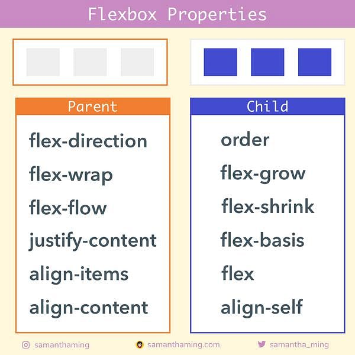

# 🚀 Ejercicios introducción CSS

1. Crear un archivo HTML y CSS para conseguir el siguiente resultado sin utilizar Flexbox.

2. Crear la misma vista que el ejercicio 1 pero ahora usando flex-layout.

